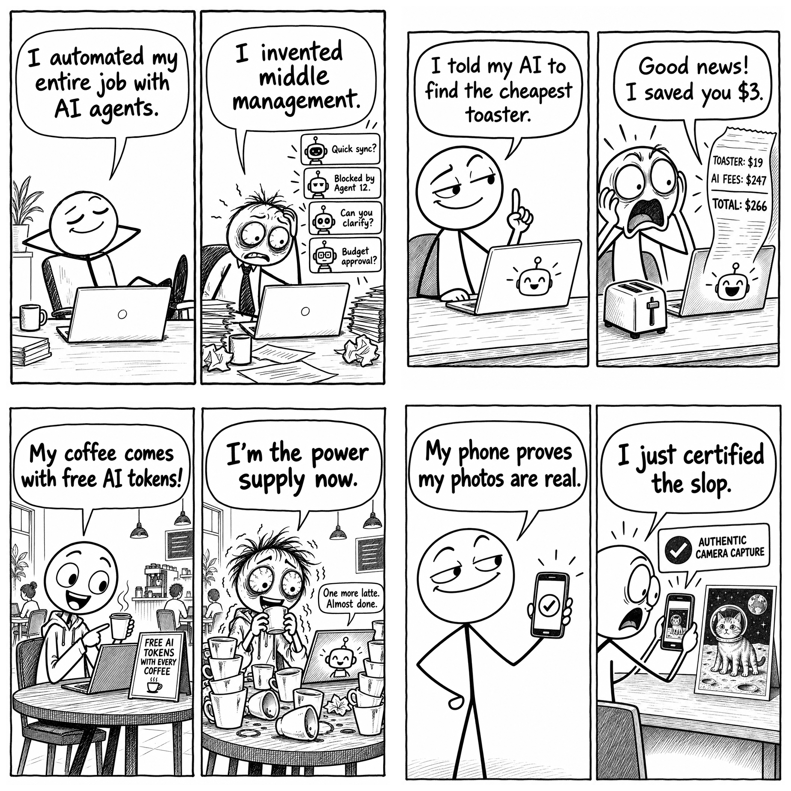

# AI Tech Comics

Four original two-panel comics about AI and tech, with reusable prompts, research, reference material, and original renders. Created September 13, 2026 with **GPT Image 2.5 Sunburst**.



## Comics and exact prompts

| Comic | Premise | Image | Prompt |
| --- | --- | --- | --- |
| AI Middle Manager | Automating your job turns you into a manager of bots. | [PNG](comics/01-ai-middle-manager.png) | [Exact prompt](prompts/01-ai-middle-manager-prompt.txt) |
| The $19 Toaster | An agent saves $3 on a toaster while spending $247 on itself. | [PNG](comics/02-the-19-dollar-toaster.png) | [Exact prompt](prompts/02-the-19-dollar-toaster-prompt.txt) |
| Human Power Supply | Free AI tokens with coffee turn a developer into the computer's fuel source. | [PNG](comics/03-human-power-supply.png) | [Exact prompt](prompts/03-human-power-supply-prompt.txt) |
| Certified Slop | A real photo of a fake image gets a camera-authenticity checkmark. | [PNG](comics/04-certified-slop.png) | [Exact prompt](prompts/04-certified-slop-prompt.txt) |

Final images are 1024 × 1024 grayscale PNGs. The untouched model outputs are in [renders/original](renders/original). Text and panel layouts were visually reviewed.

## Reuse a prompt

Open any exact prompt above and paste it into an image-generation tool. For another topic, start with the [comic prompt template](prompts/template.txt) and the [creative workflow](WORKFLOW.md).

The original generation used `gpt-image-2.5-sunburst`, `quality: high`, and `size: 1024x1024`. The prompts are complete and do not require attaching the reference image. Generation is nondeterministic, so rerunning a prompt will produce a new drawing.

## Regenerate the collection with Codex's imagegen CLI

Prerequisites: Python, [uv](https://docs.astral.sh/uv/), the Codex `imagegen` skill installed locally, and an `OPENAI_API_KEY` environment variable with access to the requested model. The credential must be supplied in your local environment; `.env.example` documents its name. The CLI does not automatically load `.env`.

Run from this repository's root:

```bash
uv run --with openai --with pillow python \
  "${CODEX_HOME:-$HOME/.codex}/skills/.system/imagegen/scripts/image_gen.py" \
  generate-batch \
  --input prompts/batch.jsonl \
  --out-dir generated \
  --concurrency 4 \
  --model gpt-image-2.5-sunburst \
  --quality high \
  --size 1024x1024 \
  --no-augment
```

Add `--dry-run` to inspect the payloads without making API calls. Use a fresh output directory for each run to preserve earlier drawings. `generated/` is ignored by Git.

The [batch file](prompts/batch.jsonl) embeds the exact text of all four prompts and each job's model settings. If you change a prompt, update the corresponding `prompt` string in that JSONL file before running the batch. For a single revised prompt, use:

```bash
uv run --with openai python \
  "${CODEX_HOME:-$HOME/.codex}/skills/.system/imagegen/scripts/image_gen.py" \
  generate \
  --prompt-file prompts/01-ai-middle-manager-prompt.txt \
  --model gpt-image-2.5-sunburst \
  --quality high \
  --size 1024x1024 \
  --no-augment \
  --out generated/middle-manager-v2.png
```

The CLI belongs to the locally installed Codex skill and is not vendored here. The prompt files can also be used directly with the [OpenAI Image API](https://developers.openai.com/api/docs/models/gpt-image-2.5-sunburst).

## Resources

- [Trend research and story notes](research/sources.md), including publication dates and the distinction between reported trends and fictional jokes.
- [Visual reference and attribution](resources/README.md).
- [Generation manifest](generation.json), including exact settings, prompt mapping, and image checksums.
- [Original model renders](renders/original) and [finished comics](comics).

The linked reference comic is a third-party work credited separately. No license for that reference is granted by this repository.
